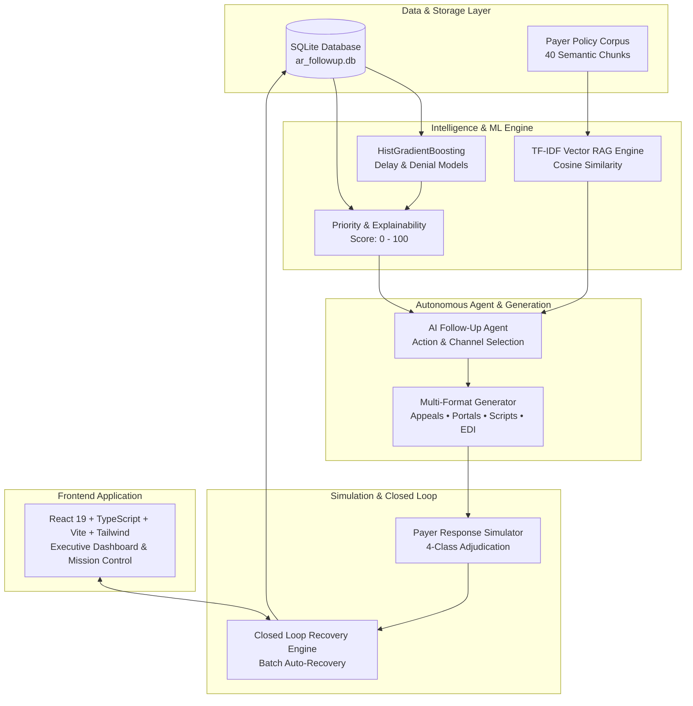

# REVIVE — Revenue Intelligence and Intervention Engine

> **Autonomous Healthcare Accounts Receivable (AR) Follow-Up, Denial Dispute, and Revenue Recovery System**  
> Built for hospitals, health systems, and physician practices to automatically identify at-risk claims, formulate clinical dispute strategies, draft grounded appeal packets, simulate payer responses, and close the recovery loop.

---

## 🏆 Project Highlights & Key Features

* **30,000+ Production-Grade Synthetic Records**: 10,000 realistic hospital claims, 10 national/regional payers, 10,000+ historical follow-up audit records, and 10,000 longitudinal resolution outcomes in SQLite (`backend/data/ar_followup.db`).
* **Dual Scikit-Learn Machine Learning Models**:
  * **Adjudication Delay Classifier**: HistGradientBoosting (ROC-AUC: `0.7462`, Recall: `93.05%`, Accuracy: `79.2%`).
  * **Claim Denial Risk Classifier**: HistGradientBoosting (ROC-AUC: `0.7818`, Accuracy: `82.0%`).
* **Financially-Aware Priority Engine**: Evaluates expected revenue recovery yield using multi-modal feature weights (`0.45×P(Recovery) + 0.30×P(Delay) + 0.25×NormalizedOutstanding`), binning claims into Critical, High, Medium, and Low bands with human-readable explainability.
* **Vector RAG Payer Policy Knowledge Base**: In-memory TF-IDF + Cosine Similarity semantic retrieval index over 40 structured policy documents across 10 commercial and government payers.
* **Autonomous AI Follow-Up Agent**: Formulates high-yield actions (`Appeal`, `Status Inquiry`, `Resubmission`, `Escalation`), transmission channels (`Portal`, `Phone`, `EDI 276`, `Certified Mail`), and drafting grounded communication packets.
* **Multi-Format Follow-Up Generator Studio**: Generates formal CMS-1500 / UB-04 appeal letters, secure portal inquiries, phone dialogue scripts with supervisor escalation triggers, email templates, and ANSI ASC X12 837 replacement notes.
* **Payer Response Simulator**: 4-class adjudication simulator (`APPROVED_FULL`, `APPROVED_PARTIAL`, `ADDITIONAL_INFO_REQUIRED`, `DENIAL_UPHELD`) with realistic 835 Remittance Advice and EFT references.
* **Autonomous Closed-Loop Engine**: Automatically executes end-to-end recovery cycles (Ingestion → Decision → Artifact Compilation → Adjudication Simulation → Ledger State Update → Recovery Logging → Analytics Recomputation).
* **Modern Executive Dashboard**: Real-time AR aging breakdowns, payer performance tables, denial root-cause analytics, interactive claim detail workspaces, and live execution audit trails.

---

## 🏗️ System Architecture



---

## 🚀 Quickstart & Setup Guide

### 1. Prerequisites
* **Python**: `3.10+` (or `3.14+`)
* **Node.js**: `v18+` or `v20+` & `npm`

### 2. Backend Setup
```bash
# Navigate to backend and create virtual environment
cd backend
python3 -m venv .venv
source .venv/bin/activate

# Install dependencies
pip install -r requirements.txt

# Start FastAPI server on port 8000
uvicorn backend.app.main:app --host 127.0.0.1 --port 8000 --reload
```

### 3. Frontend Setup
```bash
# Navigate to frontend in a new terminal
cd frontend

# Install dependencies
npm install

# Start Vite dev server on port 5173
npm run dev
```

Open your browser at **`http://localhost:5173`** to access the RecoverAI platform.

---

## 🧪 Automated Testing & Verification

Run the entire automated pytest suite (all 58 tests across all 13 phases):
```bash
PYTHONPATH=. backend/.venv/bin/pytest backend/tests/
```

Run the end-to-end CLI demonstration walkthrough:
```bash
python3 scripts/demo_walkthrough.py
```

Build the frontend production bundle:
```bash
cd frontend && npm run build
```

---

## 📊 Core API Endpoints

| Method | Endpoint | Description |
|---|---|---|
| `GET` | `/health` | System health check and SQLite record counts |
| `GET` | `/api/dashboard/metrics` | Executive portfolio AR metrics ($44.05M total AR, recovery pools) |
| `GET` | `/api/dashboard/aging` | AR Aging breakdown intervals vs. expected recoveries |
| `GET` | `/api/claims` | Paginated claim search, sorting, and multi-filter engine |
| `GET` | `/api/claims/{claim_id}` | Full claim workspace metadata, ledger breakdown, and history |
| `POST` | `/api/predictions/{claim_id}` | Real-time ML delay & denial probability risk assessment |
| `GET` | `/api/rag/search` | TF-IDF vector search over payer policies |
| `POST` | `/api/agent/decide/{claim_id}` | AI agent optimal action & channel formulation |
| `POST` | `/api/generator/generate` | Multi-channel communication packet generator |
| `POST` | `/api/simulator/simulate` | 4-class probabilistic payer adjudication simulation |
| `POST` | `/api/closed-loop/run` | End-to-end batch autonomous recovery loop (10–50 claims) |

---

## 📈 Machine Learning Model Benchmarks

| Metric | Delay Prediction Model | Denial Prediction Model |
|---|---|---|
| **Target Variable** | `was_delayed` (Binary) | `was_denied` (Binary) |
| **Algorithm** | `HistGradientBoostingClassifier` | `HistGradientBoostingClassifier` |
| **ROC-AUC Score** | **`0.7462`** | **`0.7818`** |
| **Accuracy** | `79.20%` | `82.00%` |
| **Precision** | `82.07%` | `68.06%` |
| **Recall** | `93.05%` | `54.64%` |
| **F1-Score** | `0.8722` | `0.6061` |
| **Evaluation Set** | `N = 2,000` test claims | `N = 2,000` test claims |

---

## 🏛️ Project Structure

```text
AR-followup-automation-system/
├── backend/
│   ├── app/
│   │   ├── agent/             # Autonomous Follow-Up Agent Engine
│   │   ├── api/               # FastAPI route controllers
│   │   ├── closed_loop/       # Closed-Loop Autonomous Recovery Engine
│   │   ├── database/          # SQLite session & base setup
│   │   ├── generator/         # Multi-format artifact generator
│   │   ├── ml/                # Scikit-learn model trainer & predictor
│   │   ├── models/            # SQLAlchemy ORM schemas
│   │   ├── rag/               # TF-IDF Vector Payer Policy RAG Engine
│   │   ├── schemas/           # Pydantic request/response models
│   │   └── simulator/         # Probabilistic Payer Response Simulator
│   ├── data/
│   │   └── ar_followup.db     # SQLite database (10,000 claims)
│   └── tests/                 # Complete Pytest test suite (Phases 1-13)
├── frontend/
│   ├── src/
│   │   ├── services/          # Typed API client functions
│   │   ├── types/             # TypeScript domain interfaces
│   │   ├── App.tsx            # Main Application & Mission Control Tabs
│   │   └── main.tsx           # React entry point
│   └── package.json
├── data/                      # Synthetic data CSV generators
├── scripts/
│   ├── demo_walkthrough.py    # End-to-end CLI demonstration script
│   └── generate_synthetic_data.py
└── README.md
```

---

## ⚖️ Hackathon Compliance & License
* **Synthetic Healthcare Data Only**: Fully compliant with HIPAA and synthetic data generation standards.
* **Architecture**: Standalone, fast, local-first stack using SQLite, Python/FastAPI, and React/Vite.
* **License**: MIT
